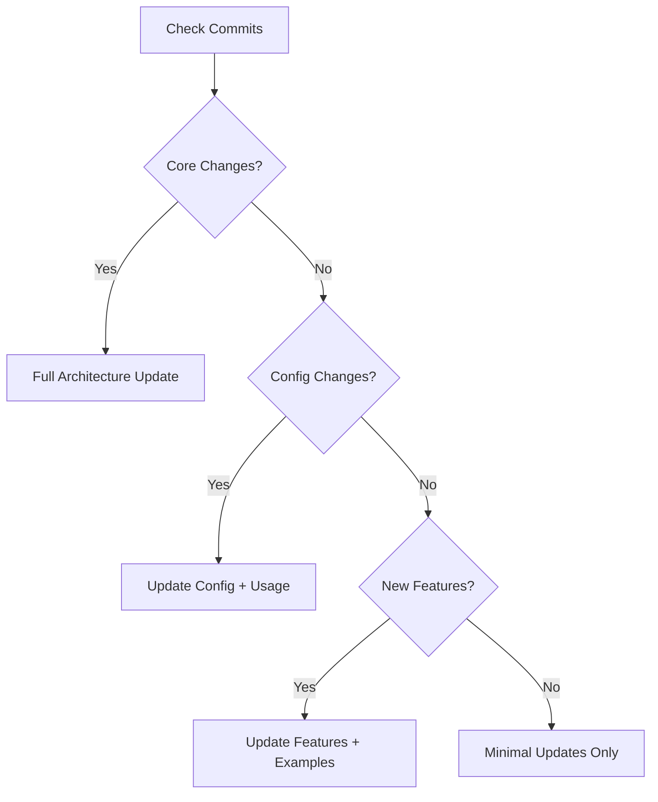
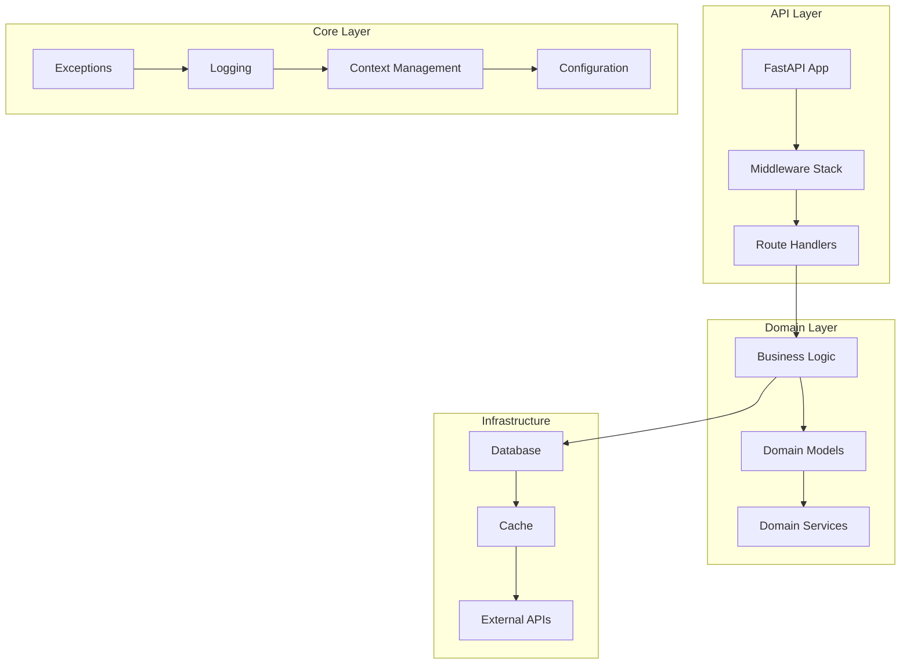
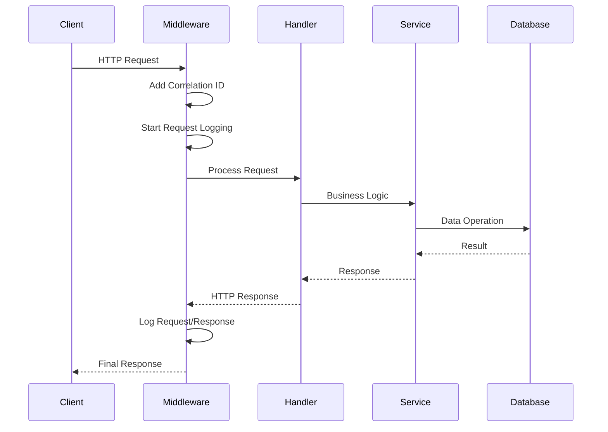
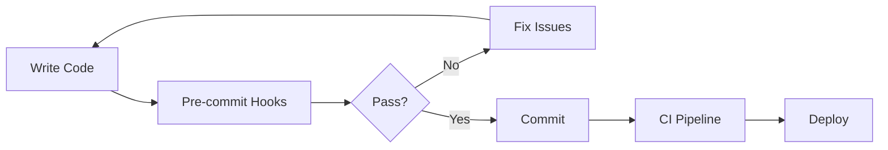

# /readme

Generate or update a comprehensive, developer-focused README.md with intelligent diff-based updates and safe emoji usage.

## Summary: Two Operating Modes

1. **Initial Generation** (No README exists)
   - Performs comprehensive discovery of ALL project features
   - Checks configuration files, tools, CI/CD, automation
   - Generates complete README with all applicable sections
   - Ensures nothing is missed

2. **Incremental Update** (README exists)
   - Reads existing README and preserves structure
   - Analyzes commits since last update
   - Updates only changed sections
   - Efficient and focused

## Execution Mode: Initial Generation vs Incremental Update

### Mode Detection
```bash
# FIRST: Determine which mode to use
if [ ! -f README.md ] || [ $(wc -c < README.md) -lt 100 ]; then
    echo "No README found - executing INITIAL GENERATION mode"
    # Perform comprehensive discovery
else
    echo "README exists - executing INCREMENTAL UPDATE mode"
    # Perform commit-based updates
fi
```

### Two Distinct Modes:
1. **Initial Generation Mode** - Comprehensive discovery and full README creation
2. **Incremental Update Mode** - Commit-based updates to existing README

## CRITICAL: README Update Process

### ⚠️ MANDATORY FIRST STEP: READ THE ENTIRE README

**BEFORE ANY CHANGES**: You MUST read the complete README.md file first. This is non-negotiable.

```bash
# Step 1: ALWAYS start here
cat README.md

# Why this is critical:
# - Understand existing structure and content
# - Identify manual edits to preserve
# - See what sections already exist
# - Understand the project's current state
# - Know where new information should fit
```

### Iterative Update Process for Multiple Commits

When updating after many commits:
1. **Read entire README** (mandatory)
2. **Check commit count** since last update
3. **Process in batches** of 10 commits max
4. **Update relevant sections** per batch
5. **Re-read README** before next batch
6. **Repeat** until all commits processed

This prevents context window overflow and ensures accurate updates.

## Initial Generation Mode: Comprehensive Discovery

### ⚠️ ONLY FOR NEW README CREATION

When creating a README from scratch, perform comprehensive discovery BEFORE writing any content.

### Discovery Checklist

#### 1. **Project Configuration Analysis**
```bash
# Read entire pyproject.toml
cat pyproject.toml

# Check for:
- [ ] All dependencies and versions
- [ ] Development tools configuration (ruff, mypy, etc.)
- [ ] Scripts and entry points
- [ ] Isolated tools configuration
- [ ] Project metadata (name, version, description)
```

#### 2. **Development Tools Discovery**
```bash
# Check for slash commands
ls -la .claude/commands/

# Check for automation scripts
ls -la scripts/

# Check pre-commit configuration
cat .pre-commit-config.yaml

# Check for Makefile commands
grep -E '^[a-zA-Z_-]+:.*?##' Makefile | sort
```

#### 3. **CI/CD Pipeline Analysis**
```bash
# Check GitHub Actions workflows
ls -la .github/workflows/
cat .github/workflows/*.yml

# Look for:
- [ ] Build and test jobs
- [ ] Security scanning
- [ ] Deployment processes
- [ ] Automated checks
```

#### 4. **Project Structure Mapping**
```bash
# Map source structure
find src -type d | head -20

# Check test organization
find tests -type d

# Look for infrastructure
ls -la terraform/ 2>/dev/null || echo "No terraform found"
```

#### 5. **Version Management**
```bash
# Check for version management
grep -A5 "bump-my-version" pyproject.toml

# Check for changelog
test -f CHANGELOG.md && echo "CHANGELOG.md exists"
```

### Required Sections for Initial Generation

Based on discovery, ensure these sections exist if applicable:

1. **Core Sections** (always include):
   - Project Overview
   - Tech Stack
   - Quick Start
   - Development Workflow
   - Project Structure

2. **Conditional Sections** (include if discovered):
   - Developer Tools & Automation (if .claude/commands/ exists)
   - CI/CD Pipeline (if .github/workflows/ exists)
   - Command Reference (if Makefile exists)
   - Version Management & Release Workflow (if bump-my-version configured)
   - Infrastructure (if terraform/ exists)
   - Security Architecture (if security tools configured)

3. **Feature-Specific Sections**:
   ```python
   DISCOVERY_MAPPINGS = {
       'has_claude_commands': 'Developer Tools & Automation',
       'has_makefile': 'Command Reference',
       'has_ci_workflows': 'CI/CD Pipeline',
       'has_precommit': 'Development Workflow (enhanced)',
       'has_isolated_tools': 'Development Tools (special note)',
       'has_terraform': 'Infrastructure',
       'has_benchmarks': 'Performance Characteristics',
       'has_changelog': 'Version Management'
   }
   ```

### Initial Generation Process

1. **Run ALL discovery checks above**
2. **Create comprehensive outline based on findings**
3. **Generate all applicable sections**
4. **Include discovered tools, commands, and workflows**
5. **Set initial metadata with first commit**

### DO NOT:
- Skip any discovery steps
- Rely on commit history for initial generation
- Assume standard features exist without checking
- Miss automation tools or CI/CD configuration

## Instructions

### Mode Selection (MANDATORY FIRST STEP)

```python
# Determine execution mode
if not os.path.exists('README.md') or os.path.getsize('README.md') < 100:
    # Execute INITIAL GENERATION MODE
    # 1. Perform comprehensive discovery (see section above)
    # 2. Generate complete README with all discovered features
    # 3. Do NOT use commit-based updates
else:
    # Execute INCREMENTAL UPDATE MODE
    # 1. Read existing README
    # 2. Analyze commits since last update
    # 3. Update only affected sections
```

### 0. **Emoji Safety & Character Encoding**

#### Safe Emoji Strategy
Use these UTF-8 safe emojis with ASCII fallbacks:
```python
SAFE_EMOJIS = {
    'rocket': ('🚀', '[=>]'),      # Project launch
    'gear': ('⚙️', '[*]'),         # Configuration
    'check': ('✅', '[OK]'),       # Success/done
    'cross': ('❌', '[X]'),        # Error/not done
    'warning': ('⚠️', '[!]'),      # Warning
    'bulb': ('💡', '[i]'),         # Tip/idea
    'fire': ('🔥', '[HOT]'),       # Performance
    'lock': ('🔒', '[SEC]'),       # Security
    'books': ('📚', '[DOC]'),      # Documentation
    'test': ('🧪', '[TEST]'),      # Testing
    'package': ('📦', '[PKG]'),    # Package/dependency
    'construction': ('🚧', '[WIP]'),  # Work in progress
    'sparkles': ('✨', '[NEW]'),  # New feature
    'bug': ('🐛', '[BUG]'),        # Bug fix
    'zap': ('⚡', '[FAST]'),       # Performance
    'art': ('🎨', '[STYLE]'),      # Code style
    'wrench': ('🔧', '[FIX]'),     # Fix/tool
    'chart': ('📊', '[STAT]'),     # Statistics
    'shield': ('🛡️', '[SHIELD]'),  # Badge/protection
}
```

#### Encoding Check
Before writing README:
```bash
# Test emoji rendering
echo -e "Test: 🚀 ⚙️ ✅" > .emoji_test
if file .emoji_test | grep -q "UTF-8"; then
    USE_EMOJIS=true
else
    USE_EMOJIS=false
fi
rm .emoji_test
```

### 1. **Enhanced Update Strategy: Semantic Diff Analysis**

#### Metadata Structure
```markdown
<!-- README-METADATA
Last Updated: 2024-12-06T10:30:00Z
Last Commit: 7c634e2
Schema Version: 2.0
Sections: {
  "overview": {"hash": "a1b2c3", "manual": false},
  "architecture": {"hash": "d4e5f6", "manual": false},
  "tech-stack": {"hash": "g7h8i9", "manual": false}
}
-->
```

#### Intelligent Section Management
1. **Section Hashing**: Track content hash for each section
2. **Manual Edit Detection**: Flag sections modified by humans
3. **Semantic Diff Analysis**: Understand what changed, not just which files
4. **Dependency Graph**: Update related sections together

#### Update Decision Tree


### 2. **Developer-Focused README Structure**

#### 🚀 Header Section
```markdown
# Tributum [STAGE] 🚀

> High-performance financial/tax/payment system built for scale and reliability

[](https://python.org)
[](https://fastapi.tiangolo.com)
[](./coverage)
[](./mypy.ini)
[](./benchmarks)

**Status**: Active Development | **Team**: Engineering Only | **Visibility**: Private
```

#### 📚 Table of Contents
Auto-generated with emoji indicators for section types

#### 🎯 Project Overview
- **Purpose**: Technical problem statement
- **Architecture Philosophy**: Design principles (DDD, clean architecture)
- **Performance Goals**: Specific metrics
- **Scale Requirements**: Expected load

#### 🏗️ Architecture Deep Dive

##### System Design


##### Request Flow


##### Key Architectural Decisions (ADRs)
1. **Correlation IDs**: UUID4-based request tracking
2. **Structured Logging**: JSON logs with orjson
3. **Exception Hierarchy**: Severity-based error handling
4. **Configuration**: Pydantic Settings v2 with validation
5. **Middleware Stack**: Pure ASGI for performance

#### ⚙️ Internal Frameworks Explained

##### Exception Framework
```python
# Severity-based exception hierarchy
TributumError (base)
├── ValidationError (400) - Input validation failures
├── UnauthorizedError (401) - Auth failures
├── NotFoundError (404) - Resource not found
└── BusinessRuleError (422) - Domain rule violations

# Usage with context capture
raise ValidationError(
    "Invalid email format",
    context={"field": "email", "value": "bad-email"},
    severity=Severity.MEDIUM
)
```

##### Logging Framework
```python
# Structured logging with automatic context
logger = get_logger()

# Automatic correlation ID binding
with log_context(user_id=123, action="payment"):
    logger.info("Processing payment", amount=100.00)
    # Output: {"event": "Processing payment", "correlation_id": "...",
    #          "user_id": 123, "action": "payment", "amount": 100.00}
```

##### Request Context Management
```python
# Correlation ID propagation via contextvars
correlation_id = RequestContext.get_correlation_id()
# Automatically included in logs, errors, and responses
```

#### 🔥 Performance Characteristics

##### Benchmarks
| Endpoint | p50 | p95 | p99 | RPS |
|----------|-----|-----|-----|-----|
| /health | 1ms | 3ms | 5ms | 10k |
| /api/info | 2ms | 5ms | 10ms | 5k |
| Complex | 20ms | 45ms | 80ms | 1k |

##### Optimization Strategies
- orjson for 2-3x faster JSON serialization
- Connection pooling for database
- Async/await throughout
- Minimal middleware overhead

#### 🛡️ Security Architecture

##### Security Layers
1. **Input Validation**: Pydantic models with strict mode
2. **Sanitization**: Automatic PII removal in logs
3. **Rate Limiting**: Per-user and global limits
4. **Authentication**: JWT with refresh tokens
5. **Authorization**: Role-based with resource permissions

##### Sensitive Data Handling
```python
SENSITIVE_PATTERNS = [
    "password", "token", "secret", "key",
    "authorization", "x-api-key", "ssn", "cpf"
]
# Automatically redacted in logs and error responses
```

#### 🧪 Testing Philosophy

##### Test Structure
```
tests/
├── unit/           # Fast, isolated tests
├── integration/    # Component interaction tests
├── e2e/           # Full system tests
└── performance/   # Load and stress tests
```

##### Testing Standards
- 100% coverage requirement for core modules
- Property-based testing for critical paths
- Mutation testing for quality assurance
- Performance regression tests

#### 🚀 Development Workflow

##### Quick Start
```bash
# Clone and setup
git clone <repo>
cd tributum-back

# Environment setup (one command)
make dev-setup  # Creates venv, installs deps, configures pre-commit

# Run with auto-reload
make dev

# Run tests with coverage
make test-coverage
```

##### Code Quality Pipeline


#### 📊 Monitoring & Observability

##### Metrics Collected
- Request rate, error rate, duration (RED)
- Business metrics (payments processed, etc.)
- System metrics (CPU, memory, connections)

##### Log Aggregation
```json
{
  "timestamp": "2024-12-06T10:30:00Z",
  "level": "INFO",
  "correlation_id": "550e8400-e29b-41d4-a716-446655440000",
  "event": "payment.processed",
  "duration_ms": 45,
  "user_id": "user_123",
  "amount": 100.00,
  "currency": "USD"
}
```

#### 🔧 Configuration Management

##### Environment Variables
```bash
# Core Settings
APP_NAME=tributum
ENVIRONMENT=development  # development|staging|production
DEBUG=true

# API Configuration
API_HOST=0.0.0.0
API_PORT=8000

# Logging
LOG_CONFIG__LOG_LEVEL=INFO
LOG_CONFIG__RENDER_JSON_LOGS=false  # true in production

# Feature Flags
FEATURE__NEW_PAYMENT_FLOW=true
FEATURE__ENHANCED_LOGGING=false
```

##### Configuration Validation
All configs validated at startup with clear error messages

#### 🎯 Troubleshooting Guide

##### Common Issues
1. **Import Errors**
   - Check Python 3.13 is active
   - Run `uv sync` to update dependencies

2. **Type Errors**
   - Ensure mypy cache is clean: `rm -rf .mypy_cache`
   - Run `uv run mypy --install-types`

3. **Performance Issues**
   - Check connection pool settings
   - Review slow query logs
   - Profile with `py-spy`

#### 🗺️ Technical Roadmap

##### Current Sprint
- [ ] Database schema implementation
- [ ] Authentication service
- [ ] API versioning strategy

##### Next Quarter
- [ ] Multi-tenant support
- [ ] Event sourcing for audit
- [ ] GraphQL API layer

##### Technical Debt
- [ ] Migrate from X to Y
- [ ] Refactor module Z
- [ ] Upgrade dependency A

### 3. **Smart Update Implementation**

#### Mode-Specific Implementation

**CRITICAL**: The implementation differs completely based on the mode:

##### Initial Generation Mode (No Existing README)
1. Perform comprehensive discovery first
2. Generate all applicable sections
3. Create complete, well-structured README
4. Set metadata with current commit

##### Incremental Update Mode (Existing README)
1. Always read the ENTIRE README first
2. Analyze commits since last update
3. Update only changed sections
4. Preserve manual edits

#### Update Process
```python
def update_readme(force=False):
    # 1. FIRST: Determine mode
    if not os.path.exists('README.md') or os.path.getsize('README.md') < 100:
        # INITIAL GENERATION MODE
        return generate_readme_from_scratch()

    # INCREMENTAL UPDATE MODE
    # 2. Read entire README first
    current_readme = read_entire_readme()
    metadata = extract_metadata(current_readme)

    # 3. Get commit range to analyze
    last_commit = metadata.last_commit
    current_head = get_current_head()

    # 4. Count commits to process
    commit_count = count_commits(last_commit, current_head)

    if commit_count > 10:
        # Process in batches to avoid context overflow
        return iterative_update(last_commit, current_head, commit_count)
    else:
        # Process all at once for small updates
        return single_batch_update(last_commit, current_head)

def generate_readme_from_scratch():
    """Initial generation with comprehensive discovery"""
    features = discover_all_features()
    sections = map_features_to_sections(features)
    readme_content = generate_all_sections(sections)
    return readme_content
```

#### Iterative Batch Processing
```python
def iterative_update(start_commit, end_commit, total_commits):
    """Process commits in manageable batches"""
    BATCH_SIZE = 10  # Process 10 commits at a time

    commits = get_commit_list(start_commit, end_commit)
    processed_commits = []

    for i in range(0, len(commits), BATCH_SIZE):
        batch = commits[i:i + BATCH_SIZE]

        # 1. Read current README state (fresh read each iteration)
        current_readme = read_entire_readme()

        # 2. Analyze this batch of commits
        batch_changes = analyze_commit_batch(batch)

        # 3. Determine affected sections
        affected_sections = identify_affected_sections(batch_changes)

        # 4. Update only those sections
        for section in affected_sections:
            update_section(section, batch_changes)

        # 5. Write updated README
        write_readme_with_updated_metadata(last_commit=batch[-1])

        # 6. Log progress
        print(f"Processed commits {i+1} to {min(i+BATCH_SIZE, len(commits))} of {total_commits}")

        processed_commits.extend(batch)

    return generate_final_summary(processed_commits)
```

#### Step-by-Step Update Workflow

1. **Initial README Read**
   ```bash
   # MANDATORY: Read entire README first
   cat README.md

   # Extract metadata
   grep -A10 "README-METADATA" README.md
   ```

2. **Commit Analysis in Batches**
   ```bash
   # Get total commit count
   LAST_COMMIT=$(grep "Last Commit:" README.md | cut -d' ' -f3)
   COMMIT_COUNT=$(git rev-list --count $LAST_COMMIT..HEAD)

   # If many commits, process in batches
   if [ $COMMIT_COUNT -gt 10 ]; then
       # Process first 10 commits
       COMMITS=$(git rev-list $LAST_COMMIT..HEAD | tail -10)
       for COMMIT in $COMMITS; do
           git show --name-only $COMMIT
       done
   fi
   ```

3. **Iterative Section Updates**
   - After analyzing each batch, update relevant sections
   - Re-read README before next batch to maintain context
   - Preserve manual edits throughout iterations

#### Section Analyzers
```python
SECTION_ANALYZERS = {
    'architecture': ArchitectureAnalyzer(),  # Looks for src/ changes
    'tech-stack': DependencyAnalyzer(),      # pyproject.toml changes
    'performance': BenchmarkAnalyzer(),      # Benchmark file changes
    'api-docs': APIAnalyzer(),              # Route changes
    'testing': TestAnalyzer(),              # Test file changes
}
```

### 4. **Detailed Update Process Instructions**

#### MANDATORY First Step: Full README Read
```bash
# ALWAYS start by reading the ENTIRE current README
cat README.md

# This is CRITICAL because:
# 1. You need to understand existing structure
# 2. You need to see what sections exist
# 3. You need to identify manual edits to preserve
# 4. You need context for where new information fits
```

#### Commit Batch Analysis Process

##### Example: 50 Commits to Process
```bash
# Step 1: Check how many commits need processing
LAST_COMMIT=$(grep "Last Commit:" README.md | cut -d' ' -f3)
git rev-list --count $LAST_COMMIT..HEAD
# Output: 50

# Step 2: Process in batches of 10
# Batch 1 (commits 1-10)
git log --oneline $LAST_COMMIT..HEAD | tail -10
git diff --name-status $LAST_COMMIT..$(git rev-list $LAST_COMMIT..HEAD | tail -10 | head -1)

# Analyze these 10 commits
# Update relevant README sections
# Write README with updated metadata

# Step 3: Re-read README for context
cat README.md

# Step 4: Process next batch (commits 11-20)
NEW_LAST=$(grep "Last Commit:" README.md | cut -d' ' -f3)
git log --oneline $NEW_LAST..HEAD | tail -10
# Continue...
```

##### Commit Type to Section Mapping
```python
COMMIT_PATTERNS = {
    # File patterns
    'pyproject.toml': ['tech-stack', 'installation'],
    'src/api/': ['api-documentation', 'architecture'],
    'src/core/': ['internal-frameworks', 'architecture'],
    'src/domain/': ['architecture', 'project-structure'],
    'tests/': ['testing'],
    'terraform/': ['deployment', 'infrastructure'],
    '.github/': ['development-workflow'],

    # Commit message patterns
    'feat:': ['features', 'roadmap'],
    'fix:': ['troubleshooting'],
    'perf:': ['performance'],
    'security:': ['security-architecture'],
    'docs:': ['relevant-section'],
}
```

#### Generation Examples

##### First Generation
Creates comprehensive README with all sections, focusing on:
- Technical depth for developers
- Performance metrics
- Security considerations
- Architecture diagrams
- Code examples from actual codebase

##### Incremental Updates (Iterative Process)
```bash
# Iteration 1: Commits 1-10 (New API endpoints)
Analyzed commits:
- feat: add user authentication endpoint
- feat: add user profile endpoint
- test: add auth tests

Updated sections:
- API Documentation (added auth endpoints)
- Testing (new test coverage)
- Architecture diagram (auth flow)

# Iteration 2: Commits 11-20 (Performance improvements)
Re-read README first!
Analyzed commits:
- perf: add Redis caching
- perf: optimize database queries
- feat: add cache warming

Updated sections:
- Performance Characteristics (new benchmarks)
- Architecture Deep Dive (caching layer)
- Configuration (Redis settings)

# Iteration 3: Commits 21-30 (Security updates)
Re-read README first!
Analyzed commits:
- security: add rate limiting
- security: implement CSRF protection
- fix: patch XSS vulnerability

Updated sections:
- Security Architecture (new protections)
- Configuration (rate limit settings)
- Troubleshooting (security FAQ)
```

#### Conflict Resolution
```markdown
<!-- CONFLICT DETECTED -->
<!-- MANUAL: Your custom content below -->
This is manually written content about our special setup...

<!-- GENERATED: New auto-generated content -->
This is what the generator wants to add...

<!-- END CONFLICT -->
```

#### Context Window Management

##### Signs You Need to Start New Iteration
1. Processing more than 10 commits
2. Analyzing files larger than 500 lines
3. Multiple major feature additions
4. Significant architectural changes

##### Best Practices
1. **Always re-read README between iterations**
2. **Update metadata after each batch**
3. **Preserve manual edits throughout**
4. **Focus on changed sections only**
5. **Summarize at the end of all iterations**

### 5. **Quality Assurance**

#### Pre-write Checks
1. Validate all code examples compile
2. Verify all commands work
3. Check all links are valid
4. Ensure emoji safety
5. Validate Mermaid diagrams

#### Post-write Validation
```bash
# Check encoding
file -b README.md  # Should be "UTF-8 Unicode text"

# Validate markdown
markdownlint README.md

# Check for broken links
markdown-link-check README.md
```

## Benefits

1. **Dual Mode Operation**: Comprehensive discovery for new READMEs, efficient updates for existing ones
2. **Never Miss Features**: Initial generation discovers ALL project features, not just visible code
3. **Developer-Centric**: Technical depth without marketing fluff
4. **Architecture-Focused**: Clear diagrams and design decisions
5. **Performance-Aware**: Benchmarks and optimization strategies
6. **Update Intelligence**: Only changes what needs changing
7. **Manual Preservation**: Respects human edits
8. **Emoji Safety**: Graceful fallbacks prevent Unicode errors
9. **Framework Documentation**: Deep dive into internal systems
10. **Efficiency**: Incremental updates remain fast and focused
