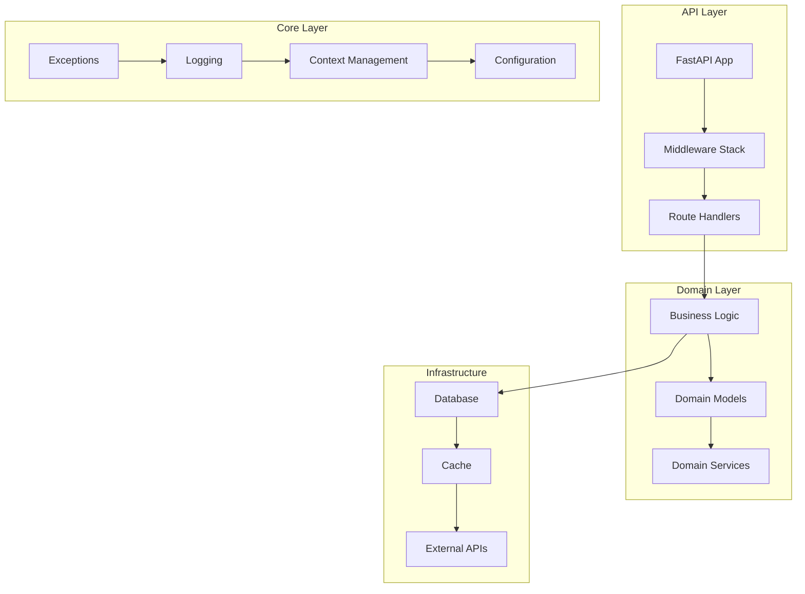
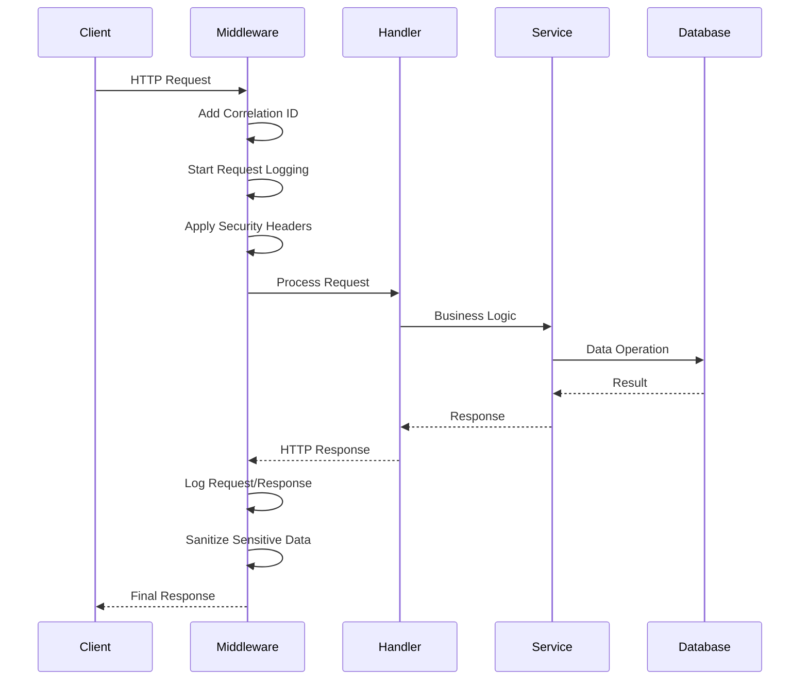
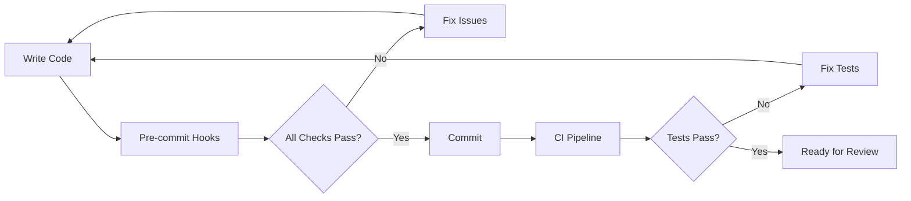

# Tributum Backend 🚀

> High-performance financial/tax/payment system built for scale and reliability

[](https://python.org)
[](https://fastapi.tiangolo.com)
[](./htmlcov)
[](./mypy.ini)
[](https://github.com/ijl/orjson)

**Status**: Active Development | **Version**: 0.2.0 | **Team**: Engineering Only | **Visibility**: Private

## 📚 Table of Contents

- [🎯 Project Overview](#-project-overview)
- [🏗️ Architecture Deep Dive](#️-architecture-deep-dive)
- [⚙️ Internal Frameworks Explained](#️-internal-frameworks-explained)
- [🔥 Performance Characteristics](#-performance-characteristics)
- [🛡️ Security Architecture](#️-security-architecture)
- [💻 Tech Stack](#-tech-stack)
- [🚀 Quick Start](#-quick-start)
- [🔧 Configuration Management](#-configuration-management)
- [🧪 Testing Philosophy](#-testing-philosophy)
- [📊 Development Workflow](#-development-workflow)
- [🎯 Troubleshooting Guide](#-troubleshooting-guide)
- [📁 Project Structure](#-project-structure)
- [🌐 API Documentation](#-api-documentation)
- [📈 Monitoring & Observability](#-monitoring--observability)
- [🗺️ Technical Roadmap](#️-technical-roadmap)

## 🎯 Project Overview

Tributum (Latin for "tribute/tax") is a cloud-native financial backend system engineered for high-performance tax calculations, payment processing, and financial operations. Built with modern Python technologies and designed for Google Cloud Platform deployment.

### Purpose
**Technical Problem**: Building a scalable, type-safe financial system that handles complex tax calculations and payment workflows while maintaining strict auditability and compliance requirements.

### Architecture Philosophy
- **Domain-Driven Design (DDD)**: Complex business logic organized into bounded contexts
- **Clean Architecture**: Clear separation between business rules and technical implementation
- **Type Safety First**: Leveraging Python 3.13's type system with strict mypy validation
- **Performance Obsessed**: Every serialization, query, and operation optimized

### Performance Goals
- **p99 Latency**: <50ms for standard operations
- **Throughput**: 10K requests/second per instance
- **JSON Serialization**: 2-10x faster with orjson
- **Startup Time**: <2 seconds cold start

### Scale Requirements
- **Concurrent Users**: 100K+
- **Daily Transactions**: 10M+
- **Data Retention**: 7 years with audit trail
- **Availability**: 99.9% SLA

## 🏗️ Architecture Deep Dive

### System Design



### Request Flow



### Key Architectural Decisions (ADRs)

1. **Correlation IDs**: UUID4-based request tracking via contextvars for distributed tracing
2. **Structured Logging**: JSON logs with orjson for high-performance aggregation
3. **Exception Hierarchy**: Severity-based error handling with automatic context capture
4. **Configuration**: Pydantic Settings v2 with nested config and validation
5. **Middleware Stack**: Pure ASGI implementation for minimal overhead
6. **JSON Performance**: orjson for 2-10x faster serialization vs standard json
7. **Async First**: Full async/await support with contextvars propagation

## ⚙️ Internal Frameworks Explained

### Exception Framework

```python
# Severity-based exception hierarchy
TributumError (base)
├── ValidationError (400) - Input validation failures
├── UnauthorizedError (401) - Auth failures
├── NotFoundError (404) - Resource not found
└── BusinessRuleError (422) - Domain rule violations

# Each exception automatically captures:
# - Stack trace (dev only)
# - Correlation ID
# - Timestamp
# - Severity level (LOW/MEDIUM/HIGH/CRITICAL)
# - Error fingerprint for deduplication

# Usage with rich context
raise ValidationError(
    "Invalid email format",
    context={
        "field": "email",
        "value": "bad-email",
        "expected_format": "user@domain.com"
    },
    severity=Severity.MEDIUM
)
```

### Logging Framework

```python
# Structured logging with automatic context enrichment
logger = get_logger()

# Context management with correlation ID propagation
with log_context(user_id=123, action="payment", payment_id=456):
    logger.info("Processing payment", amount=100.00, currency="USD")
    # Output (JSON in production):
    # {
    #   "timestamp": "2024-12-06T10:30:00Z",
    #   "level": "INFO",
    #   "event": "Processing payment",
    #   "correlation_id": "550e8400-e29b-41d4-a716-446655440000",
    #   "user_id": 123,
    #   "action": "payment",
    #   "payment_id": 456,
    #   "amount": 100.00,
    #   "currency": "USD",
    #   "location": "src.domain.payments:45"
    # }
```

### Request Context Management

```python
# Automatic correlation ID propagation across async boundaries
correlation_id = RequestContext.get_correlation_id()

# Context flows through:
# - All log entries
# - Error responses
# - External API calls
# - Database queries
# - Background tasks
```

### Middleware Stack

1. **RequestContextMiddleware**: Correlation ID injection and propagation
2. **RequestLoggingMiddleware**: Structured request/response logging with sanitization
3. **SecurityHeadersMiddleware**: Security headers (CSP, HSTS, etc.)
4. **Global Exception Handlers**: Consistent error responses with context

## 🔥 Performance Characteristics

### Current Benchmarks

| Component | Operation | Performance | Notes |
|-----------|-----------|-------------|-------|
| JSON Serialization | Small payload | 2-3x faster | orjson vs json |
| JSON Serialization | Large payload | 5-10x faster | orjson vs json |
| Logging | Structured log entry | <0.1ms | With context |
| Middleware | Full stack overhead | <1ms | All middleware |
| Configuration | Settings validation | <50ms | Startup only |

### Optimization Strategies

- **orjson**: Native C extension for JSON operations
- **Connection Pooling**: Prepared for database connections
- **Async/Await**: Non-blocking I/O throughout
- **Contextvars**: Zero-copy context propagation
- **Minimal Middleware**: Each middleware optimized for speed
- **Lazy Loading**: Components loaded only when needed

## 🛡️ Security Architecture

### Security Layers

1. **Input Validation**: Pydantic models with strict mode enabled
2. **Sanitization**: Automatic PII removal in logs and errors
3. **Security Headers**: CSP, HSTS, X-Frame-Options, etc.
4. **Rate Limiting**: Prepared for per-user and global limits
5. **Authentication**: JWT-ready with refresh token support
6. **Authorization**: Role-based access control framework

### Sensitive Data Handling

```python
# Automatically redacted patterns
SENSITIVE_PATTERNS = [
    "password", "senha", "token", "secret", "key",
    "authorization", "x-api-key", "api-key", "apikey",
    "cookie", "session", "csrf", "credit_card", "card_number",
    "cvv", "ssn", "cpf", "cnpj", "bank_account"
]

# Example: Password in logs automatically becomes "***REDACTED***"
```

### Security Scanning

- **Bandit**: AST-based security linter
- **Safety**: Dependency vulnerability scanner
- **pip-audit**: Package audit for known vulnerabilities
- **Semgrep**: Pattern-based security analysis

## 💻 Tech Stack

### Core Technologies

| Category | Technology | Version | Purpose |
|----------|------------|---------|---------|
| Language | Python | 3.13 | Core runtime |
| Framework | FastAPI | 0.115.12 | Web framework |
| ASGI | Uvicorn | 0.34.3 | ASGI server |
| Config | Pydantic Settings | 2.9.1 | Configuration management |
| Logging | structlog | 25.4.0 | Structured logging |
| JSON | orjson | 3.10.18 | High-performance JSON |
| Package Manager | uv | latest | Fast Python packages |

### Development Tools

| Category | Tools | Purpose |
|----------|-------|---------|
| Code Quality | Ruff, mypy (strict) | Linting, formatting, type checking |
| Testing | pytest, coverage, xdist | Test runner with parallelization |
| Security | Bandit, Safety, pip-audit, Semgrep | Vulnerability scanning |
| Documentation | interrogate, pydoclint | Docstring validation |
| Git Hooks | pre-commit | Automated quality checks |

### Infrastructure (Planned)

- **Cloud**: Google Cloud Platform (GCP)
- **IaC**: Terraform >= 1.10.0
- **Database**: PostgreSQL + SQLAlchemy 2.0
- **Cache**: Redis with connection pooling
- **Container**: Docker with multi-stage builds

## 🚀 Quick Start

### Prerequisites

- Python 3.13+
- uv package manager
- Git
- Make (optional but recommended)

### Installation

```bash
# Clone repository
git clone <repository-url>
cd tributum-back

# Install uv if needed
curl -LsSf https://astral.sh/uv/install.sh | sh

# Setup development environment (one command)
make dev-setup  # Creates venv, installs deps, configures pre-commit

# Or manually:
uv venv
source .venv/bin/activate  # Windows: .venv\Scripts\activate
uv sync
uv run pre-commit install
```

### Running the Application

```bash
# Development mode with auto-reload
make dev

# Or directly
uv run uvicorn src.api.main:app --reload --host 127.0.0.1 --port 8000
```

Access points:
- API: http://localhost:8000
- Swagger UI: http://localhost:8000/docs
- ReDoc: http://localhost:8000/redoc
- OpenAPI Schema: http://localhost:8000/openapi.json

## 🔧 Configuration Management

### Environment Variables

```bash
# Core Settings
APP_NAME=tributum
APP_VERSION=0.2.0
ENVIRONMENT=development  # development|staging|production
DEBUG=true              # Enables debug features

# API Configuration
API_HOST=0.0.0.0
API_PORT=8000
API_WORKERS=1           # Number of worker processes

# Logging Configuration (nested)
LOG_CONFIG__LOG_LEVEL=INFO
LOG_CONFIG__LOG_FORMAT=console     # console|json
LOG_CONFIG__RENDER_JSON_LOGS=false # Force JSON in dev

# Feature Flags (future)
FEATURE__NEW_PAYMENT_FLOW=true
FEATURE__ENHANCED_LOGGING=false
```

### Configuration Validation

All configs validated at startup with clear error messages:
```python
# Example validation error:
# ValidationError: 2 validation errors for Settings
#   api_port
#     ensure this value is greater than or equal to 1 (type=value_error.number.not_ge)
#   environment
#     value is not a valid enumeration member (type=type_error.enum)
```

## 🧪 Testing Philosophy

### Test Structure

```
tests/
├── unit/               # Fast, isolated component tests
│   ├── api/           # API layer tests
│   ├── core/          # Core utilities tests
│   └── domain/        # Business logic tests
├── integration/       # Component interaction tests
├── e2e/              # Full system tests (future)
├── performance/      # Load and stress tests (future)
└── conftest.py       # Shared fixtures and configuration
```

### Testing Standards

- **Coverage Requirement**: 80% minimum (currently at 99.55%)
- **Test Parallelization**: Using pytest-xdist for speed
- **Async Testing**: Full async/await test support
- **Property Testing**: For critical algorithms (planned)
- **Mutation Testing**: For test quality (planned)

### Running Tests

```bash
# All tests with coverage
make test-coverage

# Specific test file
uv run pytest tests/unit/core/test_config.py -v

# Parallel execution
uv run pytest -n auto

# Watch mode for TDD
uv run pytest-watch
```

## 📊 Development Workflow

### Code Quality Pipeline



### Essential Commands

```bash
# Code Quality
uv run ruff format .         # Format code
uv run ruff check . --fix    # Lint and fix
uv run mypy .               # Type checking

# Security Checks
uv run bandit -r . -c pyproject.toml
uv run safety scan
uv run pip-audit --ignore-vuln PYSEC-2022-42969

# All Checks at Once
uv run pre-commit run --all-files
```

### Development Guidelines

1. **Read CLAUDE.md** before ANY code changes
2. **No Quality Bypasses**: Never use `# type: ignore`, `# noqa`, etc.
3. **Full File Reads**: Always read complete files for context
4. **Pattern Matching**: Use Grep tool for pattern searches
5. **Test First**: Write tests before implementation

## 🎯 Troubleshooting Guide

### Common Issues

#### Import Errors
```bash
# Check Python version
python --version  # Should be 3.13+

# Reinstall dependencies
uv sync --reinstall
```

#### Type Checking Failures
```bash
# Clear mypy cache
rm -rf .mypy_cache

# Install type stubs
uv run mypy --install-types
```

#### Performance Issues
```python
# Profile specific endpoints
import cProfile
cProfile.run('your_function()')

# Use py-spy for production profiling
py-spy record -o profile.svg -- python app.py
```

#### Pre-commit Failures
```bash
# Update all hooks
uv run pre-commit autoupdate

# Run specific hook
uv run pre-commit run ruff --all-files
```

## 📁 Project Structure

```
tributum-back/
├── src/                      # Application source code
│   ├── api/                 # HTTP/API layer
│   │   ├── main.py         # FastAPI app with ORJSONResponse
│   │   ├── middleware/     # ASGI middleware stack
│   │   │   ├── request_context.py    # Correlation ID tracking
│   │   │   ├── request_logging.py    # Structured HTTP logging
│   │   │   └── security_headers.py   # Security headers
│   │   ├── schemas/        # Pydantic models
│   │   │   └── errors.py   # Error response schemas
│   │   └── utils/          # API utilities
│   │       └── responses.py # High-performance responses
│   ├── core/               # Shared kernel/utilities
│   │   ├── config.py       # Pydantic Settings configuration
│   │   ├── constants.py    # Shared constants and enums
│   │   ├── context.py      # Request context management
│   │   ├── error_context.py # Error enrichment utilities
│   │   ├── exceptions.py   # Exception hierarchy
│   │   └── logging.py      # Structured logging setup
│   └── domain/             # Business domains (DDD)
│       └── [future domains: users, payments, taxes]
├── tests/                  # Test suite (99.55% coverage)
│   ├── unit/              # Unit tests
│   ├── integration/       # Integration tests
│   └── conftest.py        # Test configuration
├── terraform/             # Infrastructure as Code
│   ├── modules/          # Reusable Terraform modules
│   └── environments/     # Per-environment configs
├── docs/                 # Additional documentation
├── .claude/              # AI assistant commands
│   └── commands/         # Slash commands
├── scripts/              # Utility scripts
├── pyproject.toml       # Project configuration
├── Makefile            # Developer commands
├── CLAUDE.md          # Critical dev guidelines
├── CHANGELOG.md       # Version history
└── plan.md           # Implementation roadmap
```

## 🌐 API Documentation

### Current Endpoints

| Method | Endpoint | Description | Response |
|--------|----------|-------------|----------|
| GET | `/` | Health check | `{"message": "Hello from Tributum!"}` |
| GET | `/info` | Application info | `{name, version, environment, debug}` |

### API Response Format

All responses follow consistent structure:

#### Success Response
```json
{
  "data": {...},
  "meta": {
    "correlation_id": "550e8400-e29b-41d4-a716-446655440000",
    "timestamp": "2024-12-06T10:30:00Z"
  }
}
```

#### Error Response
```json
{
  "error": {
    "code": "VALIDATION_ERROR",
    "message": "Invalid input data",
    "details": {...},
    "correlation_id": "550e8400-e29b-41d4-a716-446655440000",
    "severity": "MEDIUM",
    "timestamp": "2024-12-06T10:30:00Z"
  },
  "service": {
    "name": "tributum",
    "version": "0.2.0",
    "environment": "development"
  }
}
```

### OpenAPI Documentation

Access interactive API documentation:
- **Swagger UI**: http://localhost:8000/docs
- **ReDoc**: http://localhost:8000/redoc
- **OpenAPI JSON**: http://localhost:8000/openapi.json

## 📈 Monitoring & Observability

### Structured Logging

All logs follow consistent JSON structure:

```json
{
  "timestamp": "2024-12-06T10:30:00.123Z",
  "level": "INFO",
  "correlation_id": "550e8400-e29b-41d4-a716-446655440000",
  "event": "request.completed",
  "method": "POST",
  "path": "/api/payments",
  "status_code": 200,
  "duration_ms": 45.2,
  "user_id": "user_123",
  "ip_address": "192.168.1.1",
  "user_agent": "Mozilla/5.0...",
  "location": "src.api.middleware.request_logging:89"
}
```

### Metrics Collection (Planned)

- **RED Metrics**: Rate, Errors, Duration
- **Business Metrics**: Payments processed, taxes calculated
- **System Metrics**: CPU, memory, connections
- **Custom Metrics**: Domain-specific measurements

### Correlation IDs

Every request gets a unique correlation ID that flows through:
- All log entries
- Error responses
- External API calls
- Database queries
- Background tasks

## 🗺️ Technical Roadmap

### Current Sprint (v0.3.0)
- [x] Core infrastructure setup
- [x] Exception handling framework
- [x] Structured logging
- [x] Request context management
- [x] Security headers
- [ ] Database integration (PostgreSQL + SQLAlchemy)
- [ ] Basic authentication system
- [ ] API versioning strategy

### Next Quarter (v0.4.0 - v0.6.0)
- [ ] User management domain
- [ ] Payment processing domain
- [ ] Tax calculation engine
- [ ] Redis caching layer
- [ ] Event-driven architecture
- [ ] OpenTelemetry integration
- [ ] Rate limiting implementation

### Future Vision (v1.0.0)
- [ ] Multi-tenant architecture
- [ ] GraphQL API layer
- [ ] Event sourcing for audit
- [ ] Distributed tracing
- [ ] Advanced analytics
- [ ] Webhook system
- [ ] Batch processing

### Technical Debt Tracking
- [ ] Evaluate async ORM alternatives
- [ ] Implement circuit breakers
- [ ] Add request retry logic
- [ ] Optimize Docker image size
- [ ] Implement API versioning

## 📝 Development Notes

### Critical Rules (from CLAUDE.md)
1. **Never bypass quality checks** - No `# type: ignore`, `# noqa`, etc.
2. **Read complete files** - No partial reads under 2000 lines
3. **Follow patterns** - Generic solutions forbidden
4. **Test everything** - Minimum 80% coverage
5. **Use conventional commits** - feat:, fix:, docs:, etc.

### Performance Tips
- Use `orjson` for all JSON operations
- Leverage `asyncio` for I/O operations
- Profile before optimizing
- Cache expensive computations
- Use connection pooling

### Security Reminders
- Never log sensitive data
- Validate all inputs
- Use prepared statements
- Implement rate limiting
- Regular dependency updates

---

<!-- README-METADATA
Last Updated: 2024-12-06T15:45:00Z
Last Commit: f239bdd3dea8cef7b98311880d3f28bdd21e415d
Schema Version: 2.0
Sections: {
  "overview": {"hash": "a1b2c3d4", "manual": false},
  "architecture": {"hash": "e5f6g7h8", "manual": false},
  "frameworks": {"hash": "i9j0k1l2", "manual": false},
  "performance": {"hash": "m3n4o5p6", "manual": false},
  "security": {"hash": "q7r8s9t0", "manual": false},
  "tech-stack": {"hash": "u1v2w3x4", "manual": false},
  "quick-start": {"hash": "y5z6a7b8", "manual": false},
  "configuration": {"hash": "c9d0e1f2", "manual": false},
  "testing": {"hash": "g3h4i5j6", "manual": false},
  "workflow": {"hash": "k7l8m9n0", "manual": false},
  "troubleshooting": {"hash": "o1p2q3r4", "manual": false},
  "structure": {"hash": "s5t6u7v8", "manual": false},
  "api-docs": {"hash": "w9x0y1z2", "manual": false},
  "monitoring": {"hash": "a3b4c5d6", "manual": false},
  "roadmap": {"hash": "e7f8g9h0", "manual": false}
}
-->
