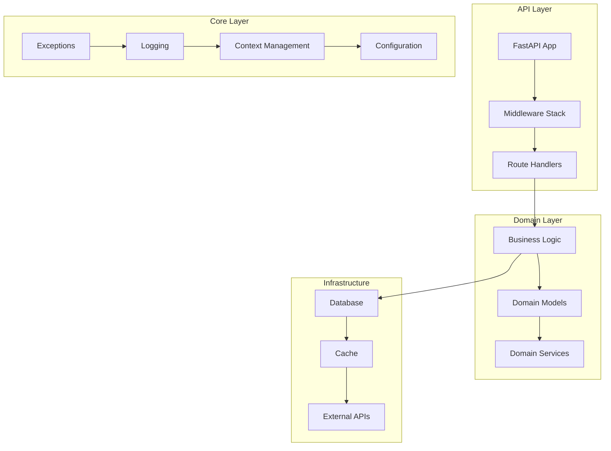
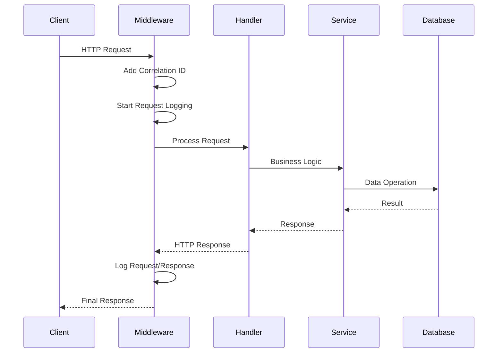
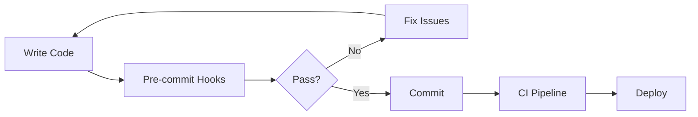

# Tributum 🚀

> High-performance financial/tax/payment system built for scale and reliability

[](https://python.org)
[](https://fastapi.tiangolo.com)
[](./htmlcov/index.html)
[](./pyproject.toml)

**Status**: Active Development | **Team**: Engineering Only | **Visibility**: Private

## 📚 Table of Contents

- [🎯 Project Overview](#-project-overview)
- [⚙️ Tech Stack](#️-tech-stack)
- [🚀 Quick Start](#-quick-start)
- [🏗️ Architecture Deep Dive](#️-architecture-deep-dive)
- [🔧 Internal Frameworks Explained](#-internal-frameworks-explained)
- [🛡️ Security Architecture](#️-security-architecture)
- [🧪 Testing Philosophy](#-testing-philosophy)
- [💻 Development Workflow](#-development-workflow)
- [🎨 Developer Tools & Automation](#-developer-tools--automation)
- [🔄 CI/CD Pipeline](#-cicd-pipeline)
- [📋 Command Reference](#-command-reference)
- [📦 Version Management & Release Workflow](#-version-management--release-workflow)
- [🏢 Infrastructure](#-infrastructure)
- [⚙️ Configuration Management](#️-configuration-management)
- [📁 Project Structure](#-project-structure)
- [🔍 Troubleshooting Guide](#-troubleshooting-guide)
- [✅ Current Implementation Status](#-current-implementation-status)

## 🎯 Project Overview

**Purpose**: High-performance financial/tax/payment system designed for enterprise-scale operations with a focus on reliability, observability, and security.

**Architecture Philosophy**:
- Domain-Driven Design (DDD) for clear business logic separation
- Clean Architecture principles for testability and maintainability
- Event-driven patterns for scalability
- Infrastructure as Code with Terraform

**Core Principles**:
- **Type Safety**: 100% strict type checking with mypy
- **Security First**: Multi-layered security scanning and input validation
- **Observable**: Structured logging with correlation IDs throughout
- **Performance**: ORJSONResponse for 3x faster JSON serialization
- **Quality**: Comprehensive testing with 100% code coverage achieved

## ⚙️ Tech Stack

### Core Framework
- **Python 3.13**: Latest Python with performance improvements
- **FastAPI 0.115+**: Modern async web framework
- **Pydantic v2**: Data validation with 50% performance boost
- **Structlog**: Structured logging with automatic context
- **ORJSON**: High-performance JSON serialization

### Development Tools
- **UV**: Fast Python package manager (10x faster than pip)
- **Ruff**: Lightning-fast Python linter and formatter with ALL rules enabled by default
- **MyPy**: Static type checker with strict mode
- **Pre-commit**: Git hooks for code quality
- **Pytest**: Testing framework with async support
- **Pytest-mock**: Improved mocking for cleaner test code
- **Pytest-env**: Centralized test environment configuration
- **Pytest-randomly**: Randomized test execution to detect inter-test dependencies
- **Pytest-check**: Soft assertions for comprehensive test failure reporting

### Security Tools
- **Bandit**: AST-based security scanner
- **Safety**: Dependency vulnerability scanner
- **Pip-audit**: Package audit tool
- **Semgrep**: Static analysis with custom rules

### Infrastructure
- **Terraform**: Infrastructure as Code
- **Google Cloud Platform**: Cloud provider
- **GitHub Actions**: CI/CD pipeline

## 🚀 Quick Start

```bash
# Clone repository
git clone https://github.com/daniel-jorge/tributum-back
cd tributum-back

# One-command setup (creates venv, installs deps, configures hooks)
make install

# Run with auto-reload
make dev

# Run all quality checks
make all-checks
```

### Essential Commands

```bash
# Development
make dev              # Run with auto-reload
make test            # Run all tests
make test-coverage   # Generate coverage report

# Code Quality
make format          # Format code
make lint           # Run linting
make type-check     # Type checking
make all-checks     # Run all checks

# Security
make security       # Run all security scans
make security-deps  # Check dependencies only
```

## 🏗️ Architecture Deep Dive

### System Design



### Request Flow



### Key Architectural Decisions (ADRs)

1. **Correlation IDs**: UUID4-based request tracking for distributed tracing
2. **Structured Logging**: JSON logs with orjson for high-performance parsing
3. **Exception Hierarchy**: Severity-based error handling with automatic context capture
4. **Configuration**: Pydantic Settings v2 with nested validation
5. **Middleware Stack**: Pure ASGI implementation for performance
6. **Response Serialization**: ORJSONResponse default for 3x faster JSON encoding

## 🔧 Internal Frameworks Explained

### Exception Framework

```python
# Severity-based exception hierarchy
TributumError (base)
├── ValidationError (400) - Input validation failures
├── UnauthorizedError (401) - Auth failures
├── NotFoundError (404) - Resource not found
└── BusinessRuleError (422) - Domain rule violations

# Usage with automatic context capture
raise ValidationError(
    "Invalid email format",
    context={"field": "email", "value": "bad-email"},
    severity=Severity.MEDIUM
)
```

**Features**:
- Automatic stack trace capture
- Severity levels (LOW, MEDIUM, HIGH, CRITICAL)
- Error fingerprinting for deduplication
- Context sanitization for sensitive data

### Logging Framework

```python
# Structured logging with automatic context
logger = get_logger()

# Correlation ID automatically bound
with log_context(user_id=123, action="payment"):
    logger.info("Processing payment", amount=100.00)
    # Output: {"event": "Processing payment", "correlation_id": "...",
    #          "user_id": 123, "action": "payment", "amount": 100.00}
```

**Features**:
- Automatic correlation ID injection
- Context preservation across async boundaries
- Sensitive field redaction
- Console (dev) / JSON (prod/staging) formatters

### Request Context Management

```python
# Correlation ID propagation via contextvars
correlation_id = RequestContext.get_correlation_id()
# Automatically included in logs, errors, and responses
```

**Features**:
- Thread-safe context storage
- Automatic propagation in async code
- X-Correlation-ID header support
- UUID4 generation with validation

## 🛡️ Security Architecture

### Security Layers

1. **Input Validation**: Pydantic models with strict mode enabled
2. **Sanitization**: Automatic PII removal in logs and error responses
3. **Security Headers**: HSTS, X-Content-Type-Options, X-Frame-Options
4. **Dependency Scanning**: Safety, pip-audit, and automated updates
5. **Static Analysis**: Bandit and Semgrep with custom rules

### Sensitive Data Handling

```python
SENSITIVE_PATTERNS = [
    "password", "token", "secret", "key",
    "authorization", "x-api-key", "ssn", "cpf"
]
# Automatically redacted in logs and error responses
```

### Security Scanning Pipeline

```bash
make security              # Run all security checks
├── bandit                # AST-based code analysis
├── safety                # Known vulnerabilities
├── pip-audit            # Package audit
└── semgrep              # Custom security rules
```

## 🧪 Testing Philosophy

### Test Structure

```
tests/
├── unit/           # Fast, isolated tests
├── integration/    # Component interaction tests
├── fixtures/       # Environment-specific test fixtures
├── conftest.py     # Shared fixtures and auto-clearing cache
└── coverage/       # Coverage reports (100% achieved)
```

### Testing Standards

- **Coverage Achievement**: 100% code coverage across entire codebase
- **Test Markers**: `@pytest.mark.unit`, `@pytest.mark.integration`
- **Async Testing**: Full async/await support with pytest-asyncio
- **Parallel Execution**: pytest-xdist for faster test runs
- **Rich Output**: pytest-rich for better test visualization
- **Mocking**: pytest-mock for cleaner, more maintainable test code
- **Environment Management**: pytest-env for consistent test configuration
- **Test Randomization**: pytest-randomly for detecting test interdependencies
- **Soft Assertions**: pytest-check for comprehensive failure visibility

### Advanced Testing Features

#### Test Randomization
Tests are automatically randomized by pytest-randomly to detect hidden dependencies:

```bash
# Run tests with random ordering (shows seed)
make test-random

# Debug with specific seed
make test-seed SEED=12345

# Disable randomization for debugging
make test-no-random
```

#### Soft Assertions
For tests with multiple related assertions, use pytest-check:

```python
import pytest_check

def test_api_response():
    with pytest_check.check:
        assert response.status_code == 200
    with pytest_check.check:
        assert response.headers["Content-Type"] == "application/json"
    with pytest_check.check:
        assert "correlation_id" in response.json()
    with pytest_check.check:
        assert response.json()["status"] == "success"
```

### Test Environment Configuration

The project uses `pytest-env` to provide consistent test environment:

```python
# Base test environment configured in pyproject.toml [tool.pytest_env]
# Sets LOG_CONFIG__LOG_LEVEL="WARNING" for cleaner test output

# Use environment fixtures for specific scenarios:
def test_production_behavior(production_env):
    """Test with production environment settings."""
    settings = get_settings()
    assert settings.environment == "production"
```

Available environment fixtures:
- `production_env` - Production environment settings
- `development_env` - Development environment settings
- `staging_env` - Staging environment settings
- `custom_app_env` - Custom app name/version for testing
- `no_docs_env` - Disabled API documentation endpoints

### Running Tests

```bash
make test              # Run all tests
make test-unit        # Unit tests only
make test-integration # Integration tests only
make test-fast        # Parallel execution
make test-coverage    # With HTML report
make test-random      # With random ordering
make test-seed SEED=12345  # Debug with specific seed
make test-no-random   # Without randomization
```

## 💻 Development Workflow

### Code Quality Pipeline



### Pre-commit Hooks

1. **Format Check**: Ruff format validation
2. **Lint Check**: Ruff with ALL rule sets enabled
3. **Type Check**: MyPy strict mode
4. **Complexity Check**: McCabe cyclomatic complexity (max 10)
5. **Security Scan**: Bandit, Safety, Semgrep
6. **Docstring Quality**: Pydoclint (Google style)
7. **Dead Code**: Vulture analysis
8. **Tests**: Fast test suite execution

### Development Best Practices

1. **Never bypass checks**: No `# type: ignore`, `# noqa`, or `--no-verify`
2. **Read complete files**: Always read entire files <2000 lines
3. **Follow patterns**: Check existing code before implementing
4. **Test everything**: Write tests for all new features
5. **Document code**: Google-style docstrings required

## 🎨 Developer Tools & Automation

### Claude Code Commands

Located in `.claude/commands/`:

- **`/analyze-project`**: Comprehensive project analysis and recommendations
- **`/commit`**: Intelligent commit with changelog updates and AI attribution prevention
- **`/release`**: Automated version bumping and release creation
- **`/readme`**: Smart README generation with incremental updates
- **`/curate-makefile`**: Makefile optimization and standardization
- **`/enforce-quality`**: Strict quality enforcement without bypasses
- **`/do`**: Execute complex tasks with expert-level guidance
- **`/investigate-deps`**: Expert dependency investigation and integration planning

### Isolated Development Tools

Some tools run in isolated environments to prevent dependency conflicts:

```bash
./scripts/tool safety scan    # Isolated safety
./scripts/tool semgrep .      # Isolated semgrep
```

Configuration in `pyproject.toml` under `[tool.isolated-tools]`.

## 🔄 CI/CD Pipeline

### GitHub Actions Workflow

**File**: `.github/workflows/checks.yml`

**Jobs**:
1. **quality-checks**: Comprehensive code quality validation
   - Format and lint checking with ALL Ruff rules
   - Type checking with MyPy
   - Complexity checking (McCabe max 10)
   - Security scanning (Bandit, Safety, pip-audit, Semgrep)
   - Dead code detection
   - Docstring quality validation
   - Test execution with coverage

2. **pre-commit**: Runs all pre-commit hooks with diff output

**Features**:
- Python 3.13 environment
- UV package manager with caching
- Parallel job execution
- Continue-on-error for non-critical tools

## 📋 Command Reference

### Development Commands

| Command | Description |
|---------|-------------|
| `make install` | Install all dependencies and pre-commit hooks |
| `make dev` | Run FastAPI with auto-reload |
| `make run` | Run the application normally |
| `make clean` | Remove all temporary files |

### Code Quality Commands

| Command | Description |
|---------|-------------|
| `make format` | Format code with Ruff |
| `make format-check` | Check formatting without changes |
| `make lint` | Run linting checks |
| `make lint-fix` | Fix linting issues automatically |
| `make type-check` | Run MyPy type checking |
| `make complexity-check` | Check McCabe cyclomatic complexity |
| `make all-checks` | Run all quality checks |

### Testing Commands

| Command | Description |
|---------|-------------|
| `make test` | Run all tests with coverage |
| `make test-unit` | Run unit tests only |
| `make test-integration` | Run integration tests only |
| `make test-coverage` | Generate HTML coverage report |
| `make test-fast` | Run tests in parallel |
| `make test-verbose` | Run with verbose output |
| `make test-failed` | Re-run only failed tests |
| `make test-random` | Run tests with random ordering |
| `make test-seed SEED=12345` | Run tests with specific seed |
| `make test-no-random` | Run tests without randomization |

### Security Commands

| Command | Description |
|---------|-------------|
| `make security` | Run all security checks |
| `make security-bandit` | Run Bandit AST scanner |
| `make security-safety` | Check for vulnerabilities |
| `make security-pip-audit` | Audit Python packages |
| `make security-semgrep` | Static analysis |

### Code Analysis Commands

| Command | Description |
|---------|-------------|
| `make dead-code` | Find unused code |
| `make dead-code-report` | Generate detailed report |
| `make docstring-check` | Check all docstrings |
| `make docstring-quality` | Validate docstring format |
| `make pylint-check` | Check for code issues |

## 📦 Version Management & Release Workflow

Uses [Semantic Versioning](https://semver.org/) with automated changelog tracking.

### Development Workflow

1. **Develop & Commit**: Use `/commit` - automatically updates CHANGELOG.md
2. **Push**: Regular `git push` after commits
3. **Release**: Use `/release` when ready to tag a version

### Version Bumping

```bash
# Managed by bump-my-version
uv run bump-my-version bump patch  # 0.2.0 → 0.2.1
uv run bump-my-version bump minor  # 0.2.1 → 0.3.0
uv run bump-my-version bump major  # 0.3.0 → 1.0.0
```

### Automated Changelog

- `/commit` adds entries to `[Unreleased]` section automatically
- Meaningful commits (feat, fix, refactor) tracked
- Test/style commits skipped
- No manual changelog editing needed

### Release Process

```bash
/release  # Analyzes changes, bumps version, creates tag
git push && git push --tags  # Push release
```

Version bump decided by changelog content:
- **PATCH**: Bug fixes, security updates
- **MINOR**: New features (any "Added" entries)
- **MAJOR**: Breaking changes, removals

## 🏢 Infrastructure

### Terraform Structure

```
terraform/
├── bootstrap/        # GCP project setup
├── environments/     # Environment configs
│   ├── dev/
│   ├── staging/
│   └── production/
├── main.tf          # Main infrastructure
└── backend.tf       # State management
```

### GCP Resources

- **Project**: tributum-new
- **Environments**: dev, staging, production
- **State Storage**: GCS backend with encryption

### Infrastructure Management

```bash
# Initialize environment
cd terraform/environments/dev
terraform init

# Plan changes
terraform plan

# Apply infrastructure
terraform apply
```

## ⚙️ Configuration Management

### Environment Variables

```bash
# Core Settings
APP_NAME=tributum
APP_VERSION=0.2.0
ENVIRONMENT=development  # development|staging|production
DEBUG=true

# API Configuration
API_HOST=0.0.0.0
API_PORT=8000
DOCS_URL=/docs
REDOC_URL=/redoc
OPENAPI_URL=/openapi.json

# Logging
LOG_CONFIG__LOG_LEVEL=INFO
LOG_CONFIG__LOG_FORMAT=console  # console|json
LOG_CONFIG__RENDER_JSON_LOGS=false  # auto-true in staging/production

# Request Logging
REQUEST_LOGGING__LOG_REQUEST_BODY=true
REQUEST_LOGGING__LOG_RESPONSE_BODY=true
REQUEST_LOGGING__MAX_BODY_SIZE=10240

# Security Headers
SECURITY_HEADERS__HSTS_MAX_AGE=31536000
```

### Configuration Validation

All configs validated at startup using Pydantic Settings v2:
- Type validation
- Required field checking
- Nested configuration support
- Environment-specific defaults
- Automatic JSON logging for staging/production environments

## 📁 Project Structure

```
src/
├── api/                    # HTTP layer
│   ├── main.py            # FastAPI app setup
│   ├── middleware/        # ASGI middleware
│   │   ├── error_handler.py      # Global exception handling
│   │   ├── request_context.py    # Correlation ID management
│   │   ├── request_logging.py    # Request/response logging
│   │   └── security_headers.py   # Security headers
│   ├── schemas/           # Pydantic models
│   │   └── errors.py     # Error response schemas
│   └── utils/
│       └── responses.py   # ORJSONResponse
├── core/                  # Shared utilities
│   ├── config.py         # Pydantic Settings
│   ├── constants.py      # Shared constants
│   ├── context.py        # Request context
│   ├── error_context.py  # Error enrichment
│   ├── exceptions.py     # Exception hierarchy
│   ├── logging.py        # Structured logging
│   └── types.py          # Type definitions
└── domain/               # Business logic (DDD structure prepared)

tests/
├── unit/                 # Isolated unit tests
├── integration/          # Integration tests
├── fixtures/             # Environment-specific test fixtures
└── conftest.py          # Shared fixtures with auto-clearing cache
```

## 🔍 Troubleshooting Guide

### Common Issues

#### Import Errors
```bash
# Ensure Python 3.13 is active
python --version

# Update dependencies
uv sync --all-extras --dev
```

#### Type Errors
```bash
# Clear MyPy cache
rm -rf .mypy_cache

# Install type stubs
uv run mypy --install-types
```

#### Pre-commit Failures
```bash
# Update hooks
uv run pre-commit clean
uv run pre-commit install --install-hooks

# Run manually
make pre-commit
```

#### Test Failures
```bash
# Run specific test
uv run pytest tests/unit/core/test_config.py -v

# Debug with print statements
uv run pytest -s

# Debug random test failures
uv run pytest --randomly-seed=12345
```

### Debug Mode

Enable debug logging:
```bash
export DEBUG=true
export LOG_CONFIG__LOG_LEVEL=DEBUG
make dev
```

## ✅ Current Implementation Status

### Implemented Features

#### Core Infrastructure
- FastAPI application with automatic OpenAPI documentation
- Pydantic Settings v2 configuration with nested support
- Domain-driven design directory structure
- High-performance JSON serialization with ORJSON

#### Exception & Error Handling
- Comprehensive exception hierarchy with severity levels
- Global exception handlers for all error types
- Standardized error responses with correlation IDs
- Automatic context capture and sanitization
- Debug information in development mode

#### Logging & Observability
- Structured logging with structlog
- Automatic correlation ID propagation
- Request/response body logging with sanitization
- Console and JSON formatters
- Sensitive data redaction
- Automatic JSON logging for staging/production environments

#### Middleware Stack
- RequestContextMiddleware for correlation IDs
- RequestLoggingMiddleware for observability
- SecurityHeadersMiddleware for security headers
- Global error handling middleware

#### Development Experience
- Comprehensive pre-commit hooks with ALL Ruff rules enabled
- McCabe cyclomatic complexity checking (max 10)
- Strict code quality enforcement (Ruff, MyPy)
- Security scanning pipeline
- 100% test coverage achieved with pytest-mock migration
- pytest-env integration for streamlined test environment management
- pytest-randomly for detecting test interdependencies
- pytest-check for soft assertions in tests
- Claude Code automation commands including `/investigate-deps`

#### CI/CD & Infrastructure
- GitHub Actions workflow for quality checks
- Terraform infrastructure for GCP
- Multi-environment support (dev/staging/prod)
- Automated version management
- Changelog automation

### Architecture Components

#### API Layer (`src/api/`)
- Main FastAPI application with ORJSONResponse
- Middleware implementations
- Error response schemas
- Utility functions

#### Core Layer (`src/core/`)
- Configuration management
- Exception definitions
- Logging setup
- Context management
- Shared constants
- Type definitions

#### Domain Layer (`src/domain/`)
- Directory structure prepared for DDD implementation
- Ready for business logic modules

#### Test Suite (`tests/`)
- Unit tests with 100% coverage achieved
- Integration tests for API endpoints
- Environment-specific test fixtures
- Shared fixtures with auto-clearing cache
- Async test support
- Migrated to pytest-mock for cleaner mocking
- pytest-env for centralized test configuration
- pytest-randomly for randomized test execution
- pytest-check for comprehensive test failure reporting

<!-- README-METADATA
Last Updated: 2025-06-20T00:10:00Z
Last Commit: 3d5cff2
Schema Version: 2.0
Sections: {
  "overview": {"hash": "a1b2c3", "manual": false},
  "tech-stack": {"hash": "updated-3d5cff2", "manual": false},
  "quick-start": {"hash": "g7h8i9", "manual": false},
  "architecture": {"hash": "j1k2l3", "manual": false},
  "frameworks": {"hash": "updated-3d5cff2", "manual": false},
  "security": {"hash": "p7q8r9", "manual": false},
  "testing": {"hash": "updated-3d5cff2", "manual": false},
  "workflow": {"hash": "v4w5x7", "manual": false},
  "tools": {"hash": "updated-3d5cff2", "manual": false},
  "cicd": {"hash": "b1c2d4", "manual": false},
  "commands": {"hash": "updated-3d5cff2", "manual": false},
  "version": {"hash": "h7i8j9", "manual": false},
  "infrastructure": {"hash": "k1l2m3", "manual": false},
  "config": {"hash": "updated-3d5cff2", "manual": false},
  "structure": {"hash": "q7r8s1", "manual": false},
  "troubleshooting": {"hash": "updated-3d5cff2", "manual": false},
  "status": {"hash": "updated-3d5cff2", "manual": false}
}
-->
